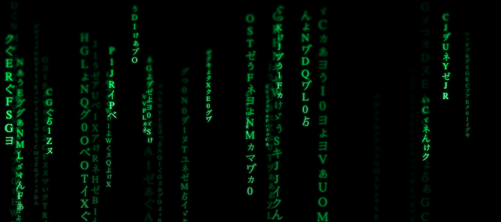

# Matrix-screen

> just4fun




You can change the variables of this const to change the behavior of the code:
```
const CONFIG;
```

```
LETTERS // letters to display
MAX_LETTERS_LENGTH // length of each sentence (random value)
QUANTITY_ITEMS // quantity of sentences in screen at sime time (random value)
LOW_OPACITY // how much opcacity use for each execution
MAX_WIDTH // max screen width
MAX_HEIGHT // max screen height
MAX_FONT_SIZE // max font size for each sentence (random value)
SPEED // speed for each sentence (random value)
PERC_SHOW_ITEMS // percentage of items in the screen, if it's lower than this value, create more items
```


> [set this page in full screen and enjoy it :)](https://raw.githack.com/jvaloto/matrix-screen/master/index.html)
